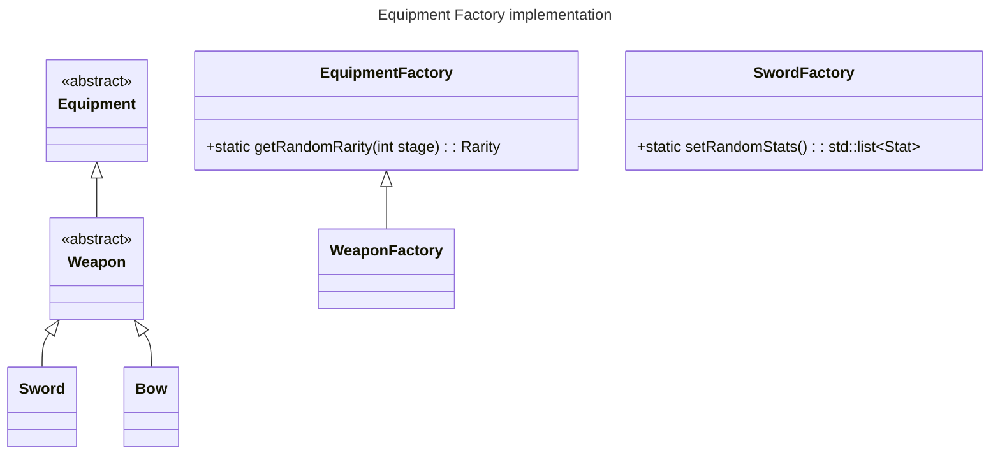

```mermaid
---
title: Equipment Factory implementation
---
classDiagram 
    class Equipment {
        <<abstract>>
    }    

    class EquipmentFactory {
        +static getRandomRarity(int stage): Rarity 
    }
    
    class Weapon {
        <<abstract>>
    }

    class WeaponFactory {
    
    }

    class Sword {
    
    }

    class Bow {
    
    }
    
    class SwordFactory {
        +static setRandomStats(): std::list~Stat~
    }
 
    EquipmentFactory <|-- WeaponFactory
    Equipment <|-- Weapon
    Weapon <|-- Sword
    Weapon <|-- Bow 
```
