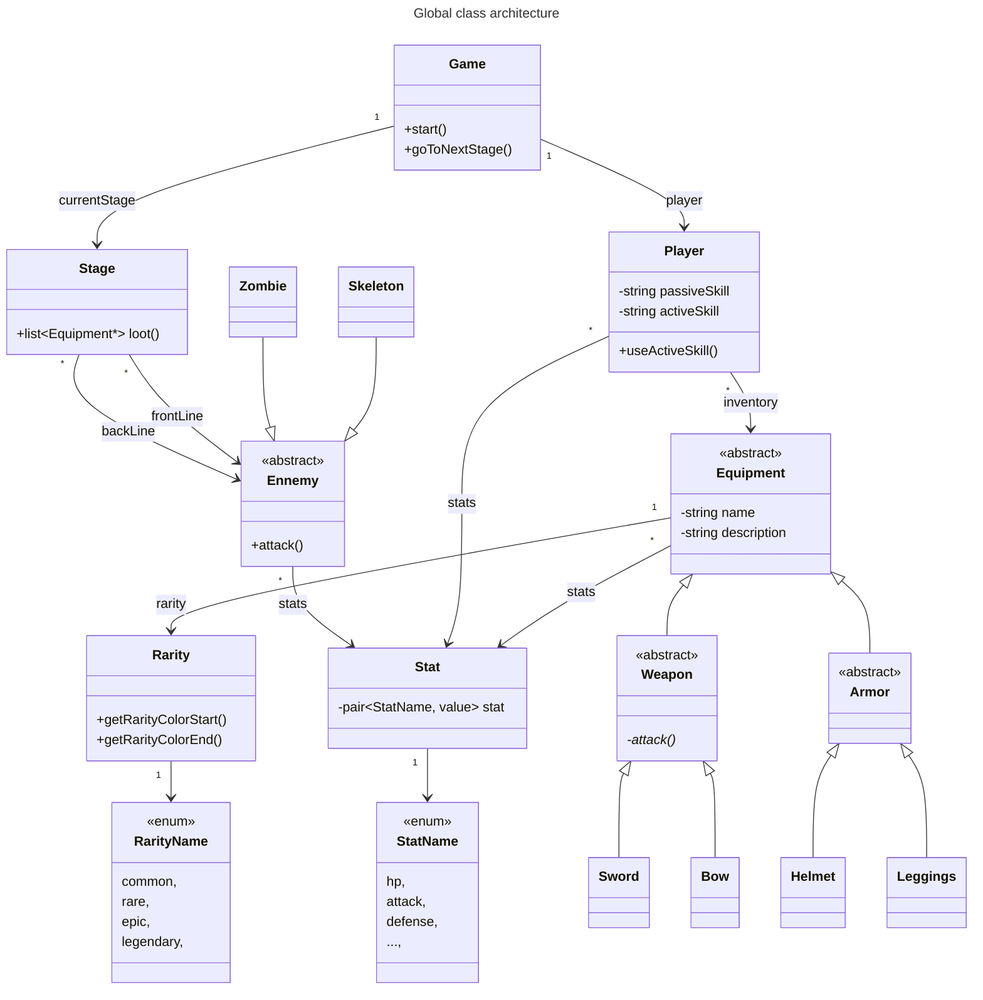

```mermaid
---
title: Global class architecture
---
classDiagram
    Rarity "1" --> RarityName
    Equipment "1" --> Rarity : rarity

    Stat "1" --> StatName

    Equipment "*" --> Stat : stats
    Player "*" --> Stat : stats
    Ennemy "*" --> Stat : stats

    Equipment <|-- Weapon
    Equipment <|-- Armor

    Armor <|-- Helmet
    Armor <|-- Leggings

    Weapon <|-- Sword
    Weapon <|-- Bow

    Skeleton --|> Ennemy
    Zombie --|> Ennemy

    Player "*" --> Equipment : inventory

    Game "1" --> Player : player 
    Game "1" --> Stage : currentStage
    class Game {
        +start()
        +goToNextStage()
    }

    Stage "*" --> Ennemy : frontLine
    Stage "*" --> Ennemy : backLine
 
    class Stage {
        +list~Equipment*~ loot() 
    }

    class Ennemy{
        <<abstract>>
        +attack()
    }
    class Skeleton{

    }
    class Zombie{

    }

    class Player{
        -string passiveSkill
        -string activeSkill
        +useActiveSkill()
    }

    class RarityName{
        <<enum>>
        common,
        rare,
        epic,
        legendary,
    }
    class StatName{
        <<enum>>
        hp,
        attack,
        defense,
        ...,
    }
    class Stat{
        -pair~StatName, value~ stat
    }
    class Rarity{
        +getRarityColorStart()
        +getRarityColorEnd()
    }
    class Equipment{
        <<abstract>>
        -string name
        -string description
    }
    class Weapon{
        <<abstract>>
        -attack()*
    }
    class Sword{

    }
    class Bow{
    
    }
    class Armor{
        <<abstract>>
        
    }
    class Helmet{

    }
    class Leggings{

    }

    
```
